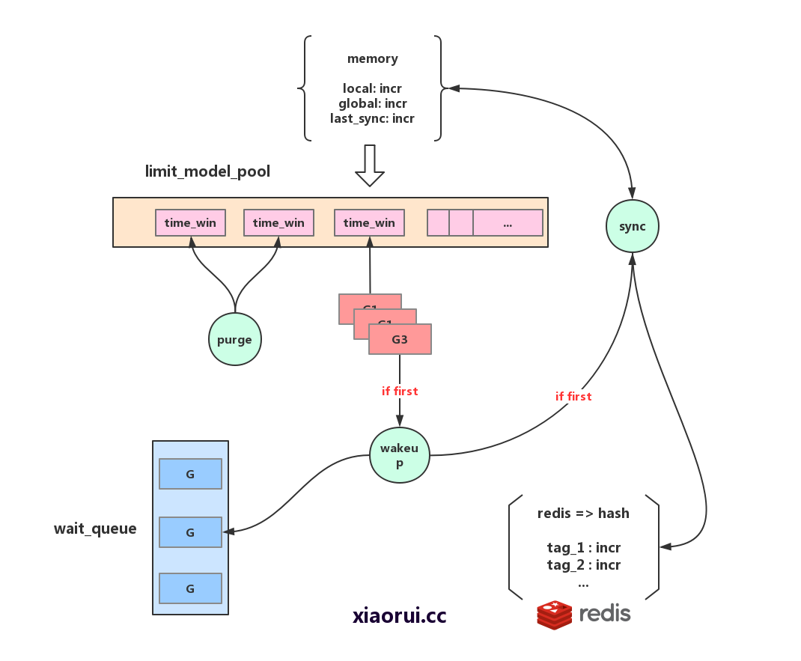

# fast_limiter

high performance distributed rate limiter

> first counter in local, timing to sync redis counter, reduce many redis's io call. of course, the delay case lose the accuracy of the data.



### Usage

```
package main

import (
	"fmt"
	"sync"
	"time"

	"github.com/rfyiamcool/fast_limiter"
)

var (
	limiter = new(fastLimiter.LimitCtl)
	opt     = fastLimiter.Options{
		TagRules: map[string]int64{
			"tag1": 100,
			"tag2": 1000,
			"tag3": 200,
		},
		AddrPort:          "127.0.0.1:6379",
		Period:            1,
		MaxlimitModelPool: 60,
		MaxSyncInterval:   time.Duration(200 * time.Millisecond),
		MaxWaiter:         10,
	}
	tag1 = "tag1"
)

func main() {
	var err error

	limiter, err = fastLimiter.New("xiaorui.cc", opt)
	if err != nil {
		panic(err.Error())
	}

	err = limiter.Incrby(tag1)
	if err != nil {
		fmt.Println(err)
	}

	tagModel, err := limiter.DumpTag(tag1)
	fmt.Println(tagModel.LocalCounter)

	for index := 0; index < 200; index++ {
		limiter.Incrby(tag1)
	}

	err = limiter.Incrby(tag1)
	fmt.Println(err)

	// wait to sync redis
	time.Sleep(1 * time.Second)

	// block wait
	wg := sync.WaitGroup{}
	for index := 0; index < 500; index++ {
		wg.Add(1)
		go func() {
			limiter.IncrbyBlock(tag1)
			wg.Done()
		}()
	}
	wg.Wait()

	err = limiter.IncrbyBlock(tag1)
	fmt.Println(err)
}

```